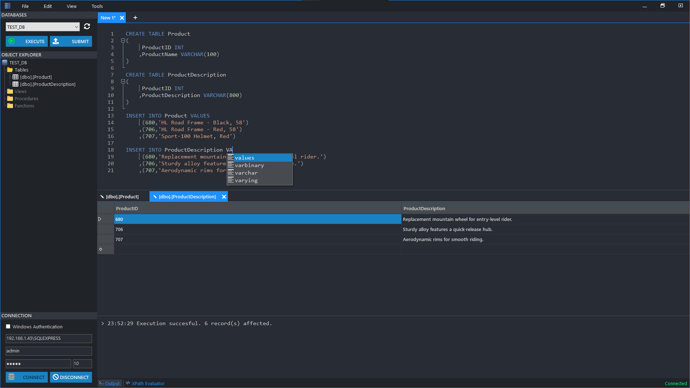
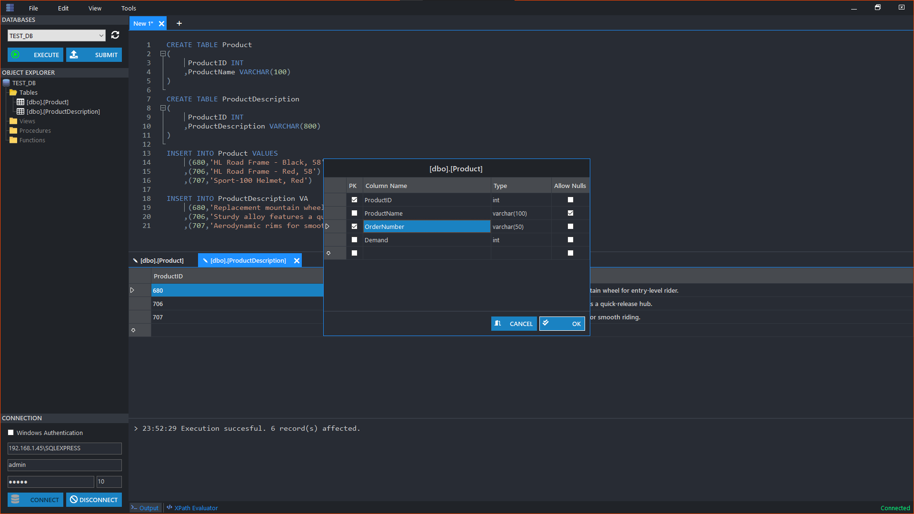

# MSSQL-Admin
Simple database administrator for SQL Server. The main purpose of this project is to show how easy is to work with SQL connections in .Net.

## Features
- Advanced SQL editor powered by ScintillaNET, that also supports autocompletion
- Visualize and edit your tables
- Execute procedures with parameters
- Modify or create new tables with the table designer
- Create backups of your databases
- Export tables to CSV or XML
- XPath evaluator
- Find and replace

**Deleting and updating rows from tables without primary does not work. It must be done manually in the SQL editor**

## NuGet packages
This project uses the following NuGet packages:
- [ScintillaNET](https://www.nuget.org/packages/jacobslusser.ScintillaNET/3.6.3?_src=template)
- [AutoCompleteMenu-ScintillaNET](https://www.nuget.org/packages/AutoCompleteMenu-ScintillaNET/1.6.2?_src=template)
- [ScintillaNET_FindReplaceDialog](https://www.nuget.org/packages/ScintillaNET_FindReplaceDialog/1.0.3.3?_src=template)
